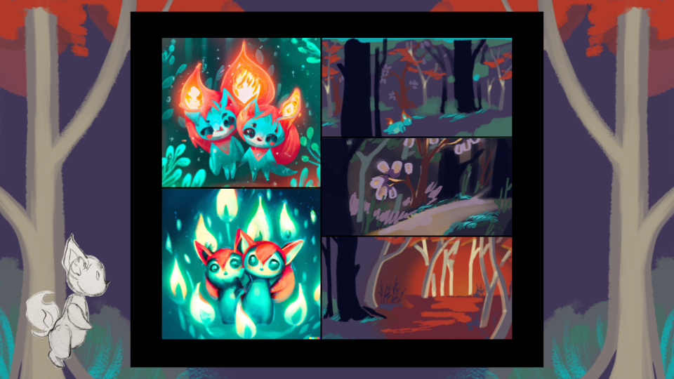

# TheDarkenedPathway
Embark on a mesmerizing journey in a world where light is scarce. As a mapmaker, you rely on a mysterious material named 'O' to guide your travels. But what if the very thing you depend on comes at a great cost? Dive deep into an enchanting VR world, bond with unique animals, and uncover the dark truth behind 'O'. Will you find an alternative, or will the weight of your choices consume you?

Welcome to the repository for the presentation on "The Darkened Pathway" game by Team Zodiac. Here, you'll find all the slides and demo videos used during our presentation.

## Slides

The presentation is divided into a series of PNG slides:

1. 
2. 
3. 
4. 
5. 
6. 
7. 
8. 
9. 
10. 
11. 
12. 
13. 
14. 

## Demo Videos

We've also included some XR demo videos to give a more immersive understanding of the game:

1. [Animal Interaction Demo](slide_2_xr_animal.mp4)
2. [World Exploration Demo](slide_4_xr_world.mp4)
3. [Gameplay Demo](slide_5_xr_demo.mp4)

## Usage

To view the slides and videos, simply clone this repository and open the files in your preferred image or video viewer.

## Feedback

We appreciate any feedback or suggestions. Feel free to raise issues or pull requests if you have any improvements or fixes.

Thank you for your interest in our project!
